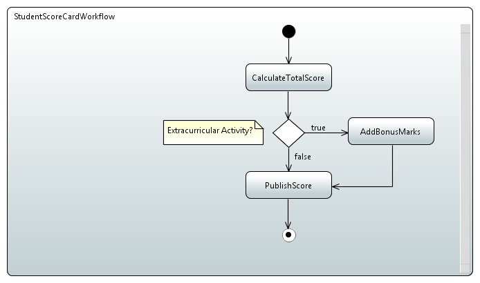

# Workflow-lite - Simple workflow engine using Spring framework and Spring Expression Language

**Workflow-lite** is a simple workflow engine using the Spring framework. As of now, it can be used to define a simple sequential workflow.

* A workflow consists of Actions to be executed in the given order.
* An action is a class performing a unit of work.
* An action can be defined as normal Spring bean with required dependencies injected.
* Apart from this the output of one action can be injected into the other action.
* Supports conditional flow.
* Supports asynchronous execution.
* Using the [Spring Expression Language](https://docs.spring.io/spring/docs/current/spring-framework-reference/html/expressions.html) one can inject original source, output of previous action, properties from execution context etc. into the action to be instantiated.
* The workflow can be defined using UML2 activity diagram.

## How is it different?
There are few blogs on how to use Spring to have a simple sequential workflow. But they mostly deal with sequential action execution without support for conditional branching. Also, in most cases, the interface for performing action takes some context which is used to pass the inputs from one action to another which makes the actions interdependent.

**Workflow-lite** on the other hand allows to define the actions as normal Java classes defining their dependencies to be injected using constructor or properties. Even the output of one action can be passed to another using dependency injection and not using the context object.  

## Prerequisites
* [Maven](https://maven.apache.org/) for building the project.
* [Papyrus](https://eclipse.org/papyrus/) eclipse plug-in for defining the workflow using UML activity diagram. 

## Adding the library reference
Add the maven dependency to your pom.xml as follows.

```xml
<dependency>
    <groupId>org.expedientframework.workflowlite</groupId>
    <artifactId>workflow-lite-core</artifactId>
    <version>1.0.0</version>
</dependency>
```

## Use case - Student score card preparation
We will define a workflow to calculate the score for a given student. The workflow will take a student object as input and have following actions:

* CalculateTotalScoreAction - Takes map of subject to marks as input and returns total of all the marks.
* AddBonusMarksAction - Takes the total score for a student and adds 10 bonus marks.
* PublishStudentScoreAction - Takes student name and total score as input and returns a simple string describing the score e.g. Student 'John Doe' scored 130 marks.

### Defining the workflow using UML activity diagram
Using the Papyrus plugin create the activity diagram as follow:



* Add the _Opaque_ action node to represent the workflow actions.
* Add the _Decision_ node to represent the condition. Since Papyrus does not show the name of condition use the comment to call out the condition.

### Implementing the actions
All the workflow actions needs to implement the [Action](src/main/java/org/expedientframework/workflowlite/core/Action.java) interface. Also, instead of directly implementing the interface consider extending the [AbstractAction](src/main/java/org/expedientframework/workflowlite/core/AbstractAction.java) or [AbstractAsyncAction](src/main/java/org/expedientframework/workflowlite/core/AbstractAsyncAction.java) as follows:

```java
public class PublishStudentScoreAction extends AbstractAction<ExecutionContext, String>
{
  public PublishStudentScoreAction(final String studentName, final int score)
  {
    this.studentName = studentName;
    this.score = score;
  }
  
  @Override
  public String execute(final ExecutionContext context)
  {
    return String.format("Student '%s' scored %d marks.", this.studentName, this.score);
  }
  
  // Private
  private final String studentName;
  private final int score;
}
```

As seen above, the [PublishStudentScoreAction](src/test/java/org/expedientframework/workflowlite/core/samples/PublishStudentScoreAction.java) simply takes the student name and score as constructor parameters and then in *execute()* returns a simple formatted string. Note that we are not using [ExecutionContext](src/main/java/org/expedientframework/workflowlite/core/ExecutionContext.java) object to pass parameters to actions but using constructor injection. Similarly, implement other actions.

### Linking the UML activity diagram with implementation
So far we have created UML activity diagram describing the workflow we need to execute and implemented the actions. But how do we link them? This is also a very simple steps. We will use String dependency injection here and define the workflow actions as beans.

* Go to the activity diagram and select an **Opaque** node.
* In the properties view click the *UML* tab.
* Select *Add* option on *Language*.
* Select *JAVA* as language and click Ok.
* On the right hand side paste the Spring bean definition for the class. For example, following bean is for [CalculateTotalScoreAction](src/test/java/org/expedientframework/workflowlite/core/samples/CalculateTotalScoreAction.java) action.
	```xml
	<bean class="org.expedientframework.workflowlite.core.samples.CalculateTotalScoreAction">
		<constructor-arg value="%{student.scores}" />
	</bean>
	```

In above bean definition we have used Spring Expression Language to pass the input. Our expression definition starts with **%{** and ends with **}**. For this example, we are passing the value of property *stores* on the student object. The *student* object is our input to the workflow. In our [StudentWorkflowExecutionContext](src/test/java/org/expedientframework/workflowlite/core/samples/StudentWorkflowExecutionContext.java) we have mentioned that the input to the workflow should be referred as *student* in the expressions. Also, there are *context* and *output* variables available. **context** refers to the [ExecutionContext](src/main/java/org/expedientframework/workflowlite/core/ExecutionContext.java) instance while **output** refers to the output from previous action. The [PublishStudentScoreAction](src/test/java/org/expedientframework/workflowlite/core/samples/PublishStudentScoreAction.java) takes two inputs: one from original input referred to as **student.name** in the expression below and other from previous activity referred to as **output** below. The **student** variable refers to [Student](src/test/java/org/expedientframework/workflowlite/core/samples/Student.java) instance while **output** is a simple numeric value. 

```xml
<bean class="org.expedientframework.workflowlite.core.samples.PublishStudentScoreAction">
	<constructor-arg name="studentName" value="%{student.name}" />
	<constructor-arg name="score" value="%{output}" />
</bean>
```

**Defining the condition**

To define the conditional flow we will again use the Spring expression.

* Go to the activity diagram and select a **Decision** node.
* Here, we will put the Spring expression as name of the node.
* For this example, we use the expression as **%{context.completedExtracurricularActivities(student.getName())}**
* Above expression states that invoke the *completedExtracurricularActivities* method on the *context* instance passing in the student name.
* The Spring expression result is then used to determine which flow to execute.
* For this to happen, we need to select the outgoing links and name them as per the expected output from expression.
* In our example, the outgoing links from decision node has name as *true* and *false* since our expression returns these values. Note that we will always do toString() on the expression result to match the outgoing link names. 

### Registering the workflow
Now that we have implemented the actions and also linked them with the given classes, it's time to register the workflows by implementing the [WorkflowDefinitionsProvider](src/main/java/org/expedientframework/workflowlite/core/WorkflowDefinitionsProvider.java) interface. When the application starts, it checks all the beans implementing this interface and invoke them one by one. The interface definition is simple as follows:

```java
public interface WorkflowDefinitionsProvider
{
  public List<InputStream> getDefinitions();
}
``` 

It just expects the list of streams of UML files having the workflow definitions. The [UmlActivityDefinitionsProvider](src/main/java/org/expedientframework/workflowlite/core/UmlActivityDefinitionsProvider.java) implements the above interface. It simply takes the file names as input and then will resolve them and return the list of streams. In your application bean, add the following bean definition:

```xml
<beans xmlns="http://www.springframework.org/schema/beans"
	xmlns:xsi="http://www.w3.org/2001/XMLSchema-instance"
	xsi:schemaLocation="http://www.springframework.org/schema/beans http://www.springframework.org/schema/beans/spring-beans.xsd">

	<import resource="spring-beans/workflow-lite-core.xml"/>
	
	<bean id="workflowDefinitions" class="org.expedientframework.workflowlite.core.UmlActivityDefinitionsProvider">
		<constructor-arg>
			<list>
				<value>classpath:workflows/workflow_definitions.uml</value>
			</list>
		</constructor-arg>
	</bean>
</beans>
```
 
In above sample, we are including the [workflow-lite-core.xml](src/main/resources/spring-beans/workflow-lite-core.xml) which has the required framework beans defined. Then we have the *UmlActivityDefinitionsProvider* taking the list of files having the UML definitions. For this example, our UML definitions are in [workflow_definitions.uml](src/test/resources/workflows/workflow_definitions.uml). You can use classpath or filepath.

### Executing the workflows
The [StudentScoreCardWorkflowTest](src/test/java/org/expedientframework/workflowlite/core/StudentScoreCardWorkflowTest.java) shows how we are going to execute the workflow. We are using **TestNG** to write the tests as follows:

```java
@ContextConfiguration(locations="classpath:wf_definitions.xml")
public class StudentScoreCardWorkflowTest extends AbstractTestNGSpringContextTests 
{
  @Test
  public void resultForNormalStudent_resultWithoutBonusMarks() 
  {
    final Student student = new Student("John Doe");
    student.addScore("History", 60);
    student.addScore("Science", 70);
    
    final String result = this.workflowManager.execute(new StudentWorkflowExecutionContext(), student);
    assertThat(result).as("Result").isEqualTo("Student 'John Doe' scored 130 marks.");
  }

  @Test
  public void resultForNormalStudent_resultWithBonusMarks() 
  {
    final Student student = new Student("Octavia Wilford");
    student.addScore("History", 60);
    student.addScore("Science", 70);
    
    final String result = this.workflowManager.execute(new StudentWorkflowExecutionContext(), student);
    assertThat(result).as("Result").isEqualTo("Student 'Octavia Wilford' scored 140 marks.");
  }
  
  // Private
  @Inject
  private WorkflowManager workflowManager;
}
```

The **@ContextConfiguration** points to the bean XML [wf_definitions.xml](src/test/resources/wf_definitions.xml) to be used which imports the [workflow-lite](src/main/resources/spring-beans/workflow-lite-core.xml) beans and specifies the path to the UML definition file as mentioned in previous section. Next we inject the instance of [WorkflowManager](src/main/java/org/expedientframework/workflowlite/core/WorkflowManager.java). The two tests are simple. They create the student instance, adds the marks and then execute the workflow passing the student instance. The logic to detemine whether student has participated in any extracurricular activity or not is simple. If the student name starts with a vowel (aeiou) then we return true else false. So the first test with student name as *John Doe* will not have any bonus marks added while the second test with student name as *Octavia Wilford* will have the bonus marks added. 

Also, notice that we are passing the instance of [StudentWorkflowExecutionContext](src/test/java/org/expedientframework/workflowlite/core/samples/StudentWorkflowExecutionContext.java). The constructor of this class takes the workflow id as input which should be the name of the UML activity and the alias to be used for refering the input which in this case is *student* since we are passing student instance. The alias is used in the Spring expressions for passing the inputs to actions or evaluating the condition.    

## Asynchronous execution
In most of the cases an action will perform some asynchronous operation or will wait on some other asynchronous operation to complete. Hence, the overall workflow execution itself needs to be asynchronous. Handling this is very easy. The action needs to simply return a [CompletableFuture<T>](https://docs.oracle.com/javase/8/docs/api/java/util/concurrent/CompletableFuture.html) and that's all. The output from the workflow itself will be a *CompletableFuture<T>* and consumer should use appropriate methods on it to listen for result or error.

## Work in progress
* Optimize the expression evaluation by caching the expressions.
* Error handling.
* Persistence support for workflows.
 	